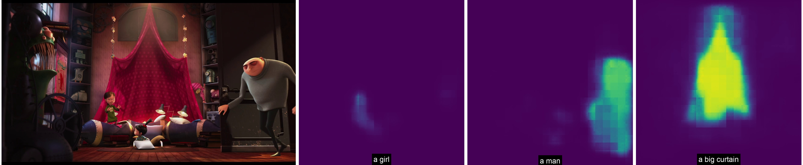
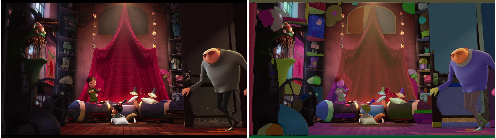
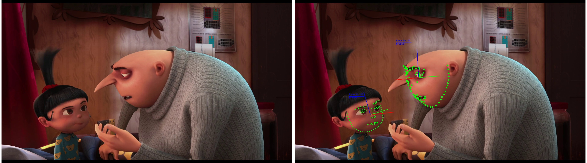
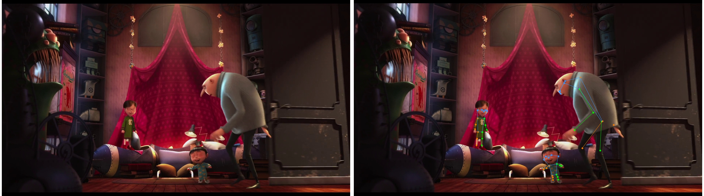
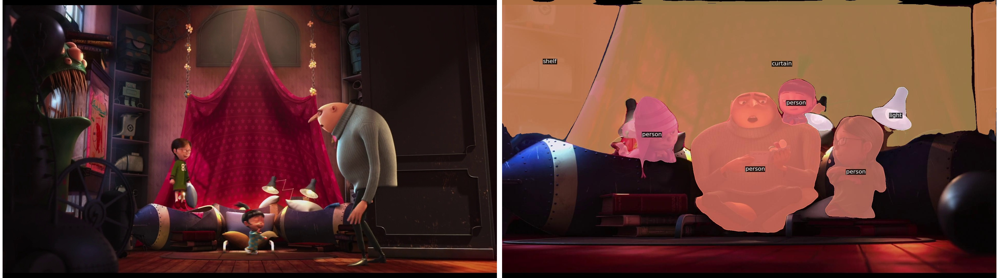
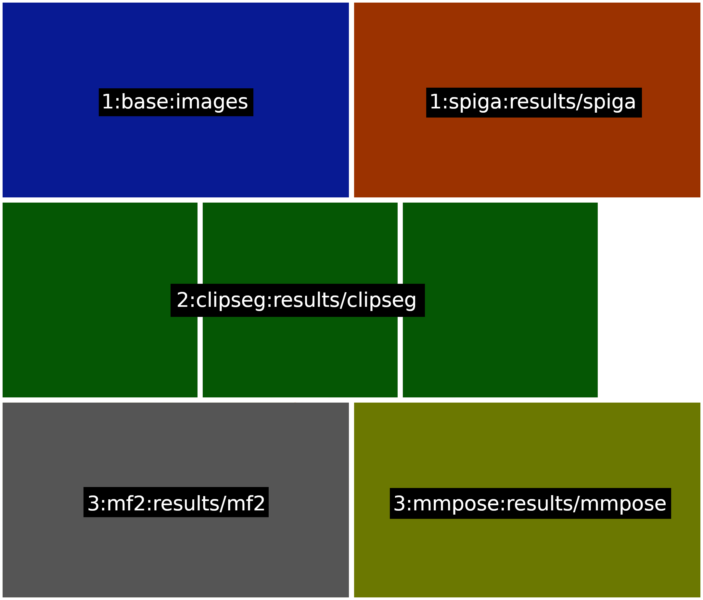
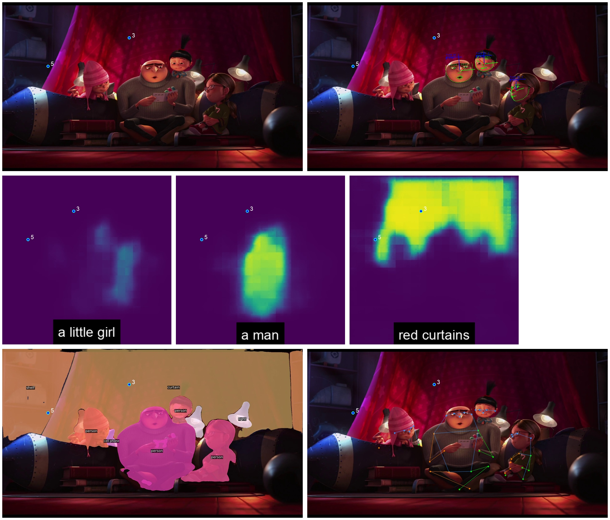
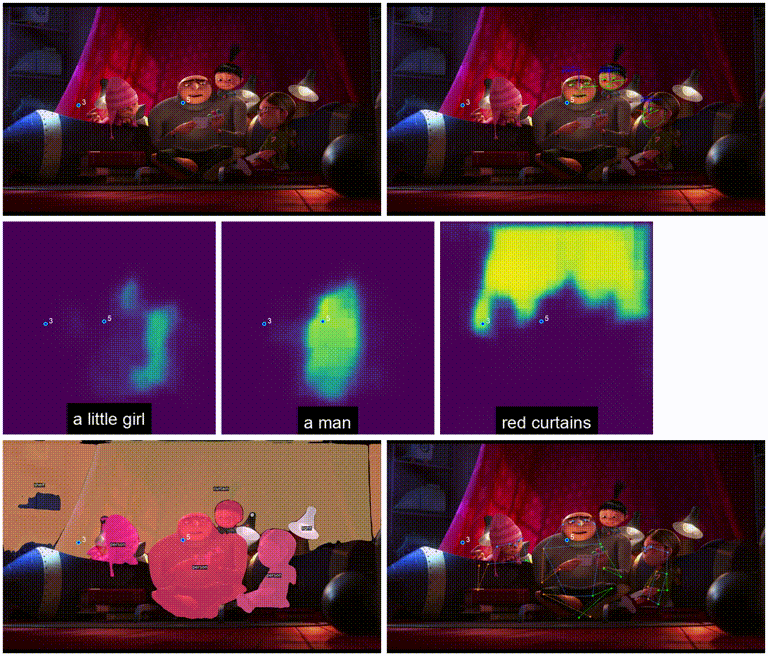

# **HSP-LAND**

This repository contains the source code needed to carry out a preliminary set of experiments within the HSP-LAND collaboration.

# :wrench: Installation & Requirements

The framework relies on the use of the code from a set of repositories available online.

All these codebases can be used in one of two ways, either:
- installing every repository locally on your machine, or 
- relying on the use of a Singularity container prepared ad-hoc.

## Repositories to install

To make use of all the functionalities available, the user should get and install the repositories listed below.

- **Segmentation** 
  - Segment Anything [REPO](https://github.com/facebookresearch/segment-anything) - [PAPER](https://arxiv.org/abs/2304.02643)
  - CLIP-Seg [REPO](https://github.com/timojl/clipseg) - [PAPER](https://arxiv.org/abs/2112.10003)
  - Mask2Former [REPO](https://github.com/facebookresearch/Mask2Former) - [PAPER](https://arxiv.org/abs/2112.01527)
  - Segment Everything Everywhere All at Once [REPO](https://github.com/UX-Decoder/Segment-Everything-Everywhere-All-At-Once) - [PAPER](https://arxiv.org/abs/2304.06718)
- **Face Landmarks Estimation**
  - SPIGA [REPO](https://github.com/andresprados/spiga) - [PAPER](https://arxiv.org/abs/2210.07233)
- **Body Pose Estimation** 
  - MMPose [REPO](https://github.com/open-mmlab/mmpose)
- **Optical Flow Estimation** 
  - UniMatch [REPO](https://github.com/autonomousvision/unimatch) - [PAPER](https://arxiv.org/abs/2211.05783)
- **Tracking**
  - TAPIR [REPO](https://github.com/deepmind/tapnet) - [PAPER](https://arxiv.org/abs/2211.03726)

In case the user decides to follow the installation steps above, skip the following subsection (**Singularity Image**) and jump directly to **General**.

## Singularity Image

[TODO]

# General

This codebase has been built with a couple of objectives in mind:

- ease of use for external, non-technical users
- flexibility w.r.t. the set of videos employed 
- simply to expand with novel methods

## Ease of Use

The code is structured in a way to separate the pipeline in a few macro-step:

- **dataset creation**: needed to convert a set of sequences from video files to frames, via the `src/utils/create_dataset.py` script
- **feature extraction**: driven by the scripts in the `src/sample` and `src/utils` directories
- **annotation and refinement**: carried out via the `lib/ui/interface.py` GUI-based program

The two steps are explained further down within this README.

<!-- For these reasons, the code will provide a restricted set of interfaces for the user, mainly through the use of a few principal scripts:

- `src/process_video.py`: for the computation of the output of the several methods available
- `src/viewers/viewer.py`: for the creation of qualitative images, associated with the outcome of one of the processing operations carried out

This pipeline will be constantly updated, and has been already improved with the introduction of the `sample_process_exp1.py` and `process_sequence.sh` scripts, detailed at the end of this README. -->

## Flexibility w.r.t. the Set of Videos

This feature is enabled by the data structure used within the development of this repository, explained in the following.

### **Data Structure**

The data is organized in a way so that any video file can be included in the dataset, still mantaining a proper organization of the subfolders.

Irrespectively from the video original filename, each video is now identified by a single incremental "ID", from 1 and onwards.

The code provides a transparent interface to include a novel video, or to retrieve an existing one, the `VideoDatabase` object:

```python
VDB = VideoDatabase("hsp-land")    
VDB.add_video("data/videos/DESPICABLEME_eng.mp4")
VDB.add_video("data/videos/Fun_with_fractals.mp4")
VDB.add_video("data/videos/PRESENT.mp4")
VDB.add_video("data/videos/TOTORO_trees_eng.mp4")
VDB.add_video("data/videos/MICHELE.mp4")
VDB.add_video("data/videos/train_neutral.mp4")
```

This will create the `data/databases/hsp-land.json` file, which acts as an auxiliary file to identify each video within the database:

```json
{
    "1": {
        "name": "data/videos/DESPICABLEME_eng.mp4",
        "fps": 24
    },
    "2": {
        "name": "data/videos/Fun_with_fractals.mp4",
        "fps": 30
    },
    "3": {
        "name": "data/videos/PRESENT.mp4",
        "fps": 24
    },
    "4": {
        "name": "data/videos/TOTORO_trees_eng.mp4",
        "fps": 30
    },
    "5": {
        "name": "data/videos/MICHELE.mp4",
        "fps": 30
    },
    "6": {
        "name": "data/videos/train_neutral.mp4",
        "fps": 30
    }
}
```

**NOTE**: that the code above will also create all the frames corresponding to a video, stored within `data/<dataset_name>/<video_id>/images`.

At this point, it is possible to retrieve the frames for a specific video, with the possibility to subsample them (note that the number specified is not the target *framerate*, but instead just a subsampling factor):

```python
frames = VDB.get_frames_for_video("data/videos/Fun_with_fractals.mp4", subsample = 5)
```

At this point, we might need to create a novel folder for an experiment. Since the main idea is for the data structure to be transparent (at the code level), the user can obtain a new folder for a given video as in:

```python
output_folder = VDB.folder_for_video("results/sam", "data/videos/Fun_with_fractals.mp4")
```

This operation will create the folder tree `results/sam` within the data structure for the dataset, by exploiting the known `filename <--> ID` correspondences.

After a few experiments or operations, the final data structure might look something like this:

```
data/ 
'-- databases/
'  '-- hsp-land.json
'-- hsp-land/
'   '-- 1/
'   '-- 2/
'   '-- 3/
'   '-- 4/
'   '-- 5/
'   '-- 6/
'       '-- images/
'           '-- frame-0000001.jpg
'           '-- frame-0000002.jpg
'           '-- ...
'       '-- results/
'           '-- unimatch/
'           '-- mf2/
'           '-- clipseg/
'               '-- frame-0000001.png
'               '-- frame-0000002.png
'               '-- ...
'-- videos/
    '-- DESPICABLEME_eng.mp4
    '-- Fun_with_fractals.mp4
    '-- PRESENT.mp4
    '-- TOTORO_trees_eng.mp4
    '-- MICHELE.mp4
    '-- train_neutral.mp4
```

For the sake of the following explanations, in the rest of this README, the folder `video_id/` (as in `1/`, `2/`, ..) for a given sequence will be called `<video_folder>`.

## Easy to Expand with Novel Methods

[explain the Wrapper idea and style]

# Methods

<!-- There is a set of candidate methods up to this point, which we will consider incrementally and for which a set of initial results will be reported over time.

- **Segmentation** 
  - Segment Anything [REPO](https://github.com/facebookresearch/segment-anything) - [PAPER](https://arxiv.org/abs/2304.02643)
  - CLIP-Seg [REPO](https://github.com/timojl/clipseg) - [PAPER](https://arxiv.org/abs/2112.10003)
  - OneFormer [REPO](https://github.com/SHI-Labs/OneFormer) - [PAPER](https://arxiv.org/abs/2211.06220)
  - MaskFormer [REPO](https://github.com/facebookresearch/MaskFormer) - [PAPER](https://arxiv.org/abs/2107.06278)
  - Mask2Former [REPO](https://github.com/facebookresearch/Mask2Former) - [PAPER](https://arxiv.org/abs/2112.01527)
  - Segment Everything Everywhere All at Once [REPO](https://github.com/UX-Decoder/Segment-Everything-Everywhere-All-At-Once) - [PAPER](https://arxiv.org/abs/2304.06718)
- **Face Landmarks Estimation**
  - SPIGA [REPO](https://github.com/andresprados/spiga) - [PAPER](https://arxiv.org/abs/2210.07233)
- **Body Pose Estimation** 
  - MMPose [REPO](https://github.com/open-mmlab/mmpose)
- **Optical Flow Estimation** 
  - UniMatch [REPO](https://github.com/autonomousvision/unimatch) - [PAPER](https://arxiv.org/abs/2211.05783)
- **Tracking**
  - TrackAnything [REPO](https://github.com/gaomingqi/Track-Anything) - [PAPER](https://arxiv.org/abs/2304.11968)
  - TAPIR [REPO](https://github.com/deepmind/tapnet) - [PAPER](https://arxiv.org/abs/2211.03726)

Not all these methods are available at the moment, up to now the repository contains what is needed to compute and visualize the output for these techniques:

- [x] Segment Anything
- [x] CLIP-Seg
- [x] SPIGA 
- [x] Mask2Former
- [x] MMPose
- [x] Segment Everything Everywhere All at Once
- [x] UniMatch
- [ ] TAPIR
- [ ] OneFormer
- [ ] MaskFormer
- [ ] Track Anything -->

## CLIP-Seg

The user has the possibility to specify a set of `prompts`  to use and for which to decode the segmentation masks. In addition, there is the possibility to `limit` the processing to a reduced number of frames.

```bash
python3 src/process_video.py --video data/videos/DESPICABLEME_eng.mp4 --method clipseg --output results/clipseg --limit 50 --prompts "a man" "a girl" "a big curtain" "a monster with big teeth"
```

Once the computation is done, the default viewer can be used to produce a set of output images, one per each processed frame.

```bash
python3 src/viewers/view.py --method clipseg --folder results/clipseg --video data/videos/DESPICABLEME_eng.mp4 --output visualization/clipseg
```



## Segment Anything (SAM)

The default method implmented here makes use of the grid-based approach through which the Segment Anything dataset (SA-1B) has been created.

A set of points is sampled across the image, and used as the base for the prompt-based generation of the masks, as explained in Section 4 of the [Segment Anything paper](https://arxiv.org/abs/2304.02643).

**NOTE**: this is the output provided by using the default parameters for the algorithm. Further tuning would probably provide better masks.

```bash
python3 src/process_video.py --video data/videos/DESPICABLEME_eng.mp4 --method sam --output results/sam --limit 50
```

The outcome can be then visualized thanks to the `view.py` script.

```bash
python3 src/viewers/view.py --method sam --folder results/sam --video data/videos/DESPICABLEME_eng.mp4 --output visualizations/sam
```



## SPIGA

This method relies on an external face detector (in this case, based on [RetinaFace](https://github.com/serengil/retinaface)) and provides an estimation of facial landmarks on top of the faces detected.

The calls to process a sequence using this method are similar to the previous ones, and are as follows:

```python
python3 src/process_video.py --video data/videos/DESPICABLEME_eng.mp4 --method spiga --output results/spiga --limit 50
```

```python
python3 src/viewers/view.py --method spiga --folder results/spiga --video data/videos/DESPICABLEME_eng.mp4 --output visualization/spiga
```




## MMPOSE

The algorithms implemented within the MMPose framework allow to estimate the pose for a set of different entities: human joints, animal joints, or face landmarks.

The default visualization implemented in the framework is the one related to human pose estimation, and the code can be used in the following way to produce qualitative output for that:

```python
python3 src/process_video.py --video data/videos/DESPICABLEME_eng.mp4 --method mmpose --output results/mmpose --limit 50
```

```python
python3 src/viewers/view.py --method mmpose --folder results/mmpose --video data/videos/DESPICABLEME_eng.mp4 --output visualization/mmpose
```




<!-- ## MaskFormer2

MaskFormer 2 is one of the top performing recent instance segmentation methods.

XXXXXXXXXXXXXX

```python
python3 src/process_video.py --video data/videos/DESPICABLEME_eng.mp4 --method mf2 --output results/mf2 --limit 50
```

```python
python3 src/viewers/view.py --method mf2 --folder results/mf2 --video data/videos/DESPICABLEME_eng.mp4 --output visualization/mf2
```

 -->

---

# Utilities

Included in this repositories are a set of utilities meant to ease the user experience when carrying out a set of specific tasks.

## Produce Dummy Gaze Data for Visualization 

Since the 

For now, for every image named `frame-XXXXXX.jpg`, the gaze visualization code expects a corresponding `frame-XXXXXX.txt` file to be available, containing the data about the gaze to be rendered.

The `frame-XXXXXX.txt` file contains entries (rows) in the format `x,y,label`, and the following examples shows the content of a sample gaze file:

```
0.7974334584121431,0.5391578576660154,3
0.5469894291992186,0.437883429175395,5
```

**NOTE**: the gaze is reported with values normalized within the 0-1 range, so that the visualization can work with any image format in the results

Since this gaze information might be unavailable, the `produce_gaze_data.py` script creates a set of files containing dummy gaze data entries for all the frames of a video.

```bash
python src/utils/produce_gaze_data.py --video data/videos/TOTORO_trees_eng.mp4
```

This will create and populate a `gaze/` folder within the dataset, for the video specified. At the moment, the folder is populated with entries representing two dummy gaze sequences with IDs `3` and `5`, moving respectively in a circular and an infinite-like pattern.

---

## Run a Sample Experiment on Six Videos

The repository is shipped with a sample script (`src/sample/sample_process_exp1.py`) which runs all the available algorithms on all the six initial videos considered for this project.

```bash
python src/utils/sample_process_exp1.py
```

As it can be seen by inspecting its content, this file specifies the processing of a set of sequences, within specific intervals.

```python
# target folder where to store the qualitative outputs
output_folder = "results"
output_folder_multi_visualization = "multivis"

# list of (sub)sequences to process
sequences = [
             {"name": "data/videos/DESPICABLEME_eng.mp4",
              "prompts": "'red curtains' 'a man' 'a little girl'",
              "limits": ("1:46","3s"),
              "gaze": ""},
             
             {"name": "data/videos/Fun_with_fractals.mp4",
              "prompts": "'broccoli'",
              "limits": ("1:09","3s"),
              "gaze": ""},
             
             {"name": "data/videos/PRESENT.mp4",
              "prompts": "'a boy' 'a dog' 'a door'",
              "limits": ("3:03","3s"),
              "gaze": ""},
             
             {"name": "data/videos/TOTORO_trees_eng.mp4",
              "prompts": "'a child' 'a bunny like monster' 'a tree'",
              "limits": ("2:15","3s"),
              "gaze": ""},

             {"name": "data/videos/MICHELE.mp4",
              "prompts": "'a man' 'a chair' 'a tv screen'",
              "limits": ("0:48","3s"),
              "gaze": ""},

             {"name": "data/videos/train_neutral.mp4",
              "prompts": "'a child' 'a woman' 'a toy car'",
              "limits": ("0:03","3s"),
              "gaze": ""}

             ]

# main processing loop
for seq in sequences:

    cmd = f"./src/utils/process_sequence.sh {seq['name']} {seq['limits'][0]} {seq['limits'][1]} \"{seq['prompts']}\" {output_folder} {output_folder_multi_visualization} {seq['gaze']}"
    
    print(f"[EXP1] Running: {cmd}")
    os.system(cmd)
```

The `"limits"` entries should be specified in the format `(starting_time,duration_in_seconds)`.

The outcome of the processing will be saved in the `results/` subfolders within the dataset directory tree, together with a multi-visualization involving the CLIP-Seg, SPIGA, MaskFormer2, MMPose, Segment Everything Everywhere All at Once, and UniMatch methods.

---

### The `process_sequence.sh` script

This script carries out the processing with all the methods available and creates the "multi-visualization" from the results.

For now, all the methods included in the framework are run sequentially, one further customization of this script will be in the direction of allowing to select the techniques to actually run once executed.

```bash
...

python3 src/smart_process_video.py --method clipseg ...

python3 src/smart_process_video.py --method spiga ...

python3 src/smart_process_video.py --method mf2 ...

python3 src/smart_process_video.py --method mmpose ...

python3 src/smart_process_video.py --method seem ...

python3 src/smart_process_video.py --method unimatch ...

python3 src/viewers/multiview.py --format 1:base:images 1:spiga:$output_folder/spiga 1:mmpose:$output_folder/mmpose 2:clipseg:$output_folder/clipseg 2:mf2:$output_folder/mf2 2:unimatch:$output_folder/unimatch 3:seem:$output_folder/seem --output $output_folder_multivis --video $video_title --target_height 600 --padding 8 $start_text
```

The `smart_process_video.py` script takes in charge of activating the correct Anaconda environment w.r.t. the `--method` specified as a parameter, so to finally invoke the main processing script.

---

## A Note on the Multi-Visualization Script

The multi-visualization script is an utility (which is often invoked automatically during the processing) that allows to produce custom renderings of the results for an experiment.

In particular, it allows to compose mosaic-like visualizations, in order to appreciate qualitatively the outcome of the processing via the several methods available.

The following is an example of invocation of the multi-visualization script:

```bash
python3 src/viewers/multiview.py --format 1:base:images 1:spiga:results/spiga 2:clipseg:results/clipseg 3:mf2:results/mf2 3:mmpose:results/mmpose --output multivis --video "data/videos/DESPICABLEME_eng.mp4" --target_height 600 --padding 8 --gaze_data gaze 
```

In this specific call, the arguments are:

- `format`: a customized string that allows to 
- `output`: the subfolder of `<video_folder>` in which to store the result of the visualization
- `target_height`: the target height to use for every frame, in the final mosaic image
- `padding`: the white padding to insert between the frames
- `gaze_data`: the directory within the `<video_folder>` containing the gaze data for the sequence (as briefly explained in the section **Produce Dummy Gaze Data for Visualization**)

**NOTE**: the `format` parameter is the most crucial one to achieve the intended composed visualization of the multiple outputs computed. The string is formed by several `<row>:<visualization>:<folder>` entries each one specifying:

- in which `row` to draw the entry
- which `visualization` method to use (drives the way the output files are retrieved and rendered)
- from which `folder` to gather the results

In case several entries share the same `row` number, those are stacked horizontally one after another.

Thus, the string `--format 1:base:images 1:spiga:results/spiga 2:clipseg:results/clipseg 3:mf2:results/mf2 3:mmpose:results/mmpose` will drive the framework to produce output frames made composed in this way:



The argument `--gaze_data gaze` used in the call above also loads the "dummy" gaze data produced via another script available within this framework. The GIF below shows an example of the final results, displaying one frame at a time (remind that the output of the multi-visualization script is still represented by **single frames**).

<!--  -->


---

## Recovering Results from an Experiment

The `src/utils/gather_results.py` provided allows to recover easily a set of folders resulting from a given experiment, by creating a single .zip file containing the material requested. 

This script makes use of the same convention introduced above, i.e. the results for a given video are retrieved by means of its filename. 

```bash
python3 src/utils/gather_results.py --video data/videos/DESPICABLEME_eng.mp4 --output results.zip --folders multivis
```

This call will zip the multi-visualization produced by running the code described previously in this repository, zipping all the frames into a `results.zip` file, which can then be easily retrieved remotely with any utility as the `scp` command.
